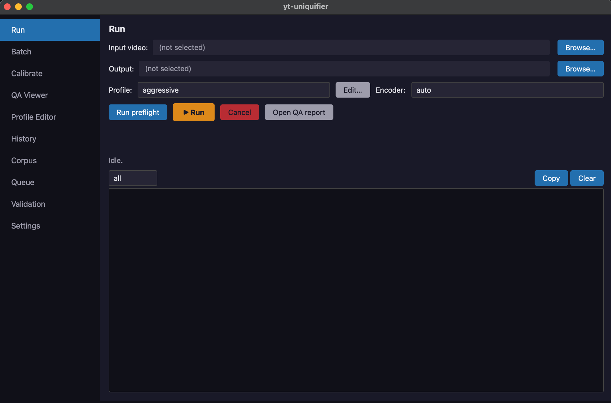

# yt-uniquifier

> Production-grade re-encoder with controlled, calibrated micro-transforms for
> owned or licensed video content. **Current release: v0.5.4** —
> PyQt6 desktop UI with 10 functional screens on top of the v0.4 CLI:
> CID-aware profiles past Smitelli's documented thresholds, academic-paper-
> verified temporal jitter, audio-FP Hamming KPI, divergent per-segment seeds,
> HDR→SDR tonemap, parallel CPU/GPU encoding, distributed batch on shared FS.



## What it does

- **One CLI** (10 commands) + optional **PyQt6 GUI** on top of `ffmpeg`.
- **18 micro-transforms** composed into a single `-filter_complex` per ffmpeg
  invocation: crop+rescale, color jitter, noise, rotation, mirror, frame-blend,
  HDR→SDR tonemap, **temporal frame jitter** (Fojcik & Syga 2025), pitch /
  tempo (formant-preserving rubberband), EQ, audio resample, spectral smear,
  compand (dynamic-range jitter), reverb, Haas stereo widening, **parametric
  noise overlay** (pink/white/brown), EBU R128 loudness normalization with
  target jitter.
- **Keyframe-aware split** → per-segment process → concat demuxer, so multi-hour
  files survive Ctrl+C and resume from `state.json` on the next run.
- **Multi-track audio**, soft subtitles, and chapters are passed through.
- **Real HDR support** via zscale linear-light wrap when keeping HDR, or via
  `video.tonemap_sdr` (hable / reinhard / mobius / aces) when targeting SDR.
- **Multi-vendor encoder detect** (NVENC / QSV / AMF / VideoToolbox /
  libx264 / libx265) with real test-run on a null source; each candidate
  carries its own `max_parallel` cap (NVENC consumer = 3, pro = 8, CPU = ½ cores).
- **Per-run variability**: every invocation rolls a fresh `run_seed`, so two
  runs of the same profile against the same source produce different
  fingerprints — useful for uploading N distinct variants.
- **Content-ID-aware QA**: chunked per-4-sec pHash + audio Jaccard
  predictor, optional check against a local **corpus** of previously
  uploaded files (`yt-uniq corpus add ...`). HTML report includes a
  per-chunk heatmap so the **weakest chunk** is visible at a glance.
- **Automated calibration** (`yt-uniq calibrate`): bisects profile intensity
  against a target `match_probability` for your specific content.
- **Distributed batch** via shared filesystem: `yt-uniq worker` drains a
  queue across N machines using atomic POSIX rename leasing —
  **no redis / no database**, just NFSv4 with `noac` (or ZFS / ext4).

## What it is NOT

A tool to evade rights-holder detection of third-party copyrighted material.
The intended scenarios are: re-uploading your own content, distributing
licensed material in multiple cuts, or producing fair-use derivatives. If your
use case is "make YouTube Content ID stop matching someone else's movie" —
this is the wrong tool, and I won't help you wire it up.

## Install

Requires Python 3.11+ and `ffmpeg` / `ffprobe` on `PATH`.

**TL;DR — three commands:**

```bash
git clone https://github.com/Hostlife22/yt_uniquifier.git && cd yt_uniquifier
python3.12 -m venv .venv && source .venv/bin/activate && pip install -e ".[dev,gui]"
yt-uniq-gui                       # GUI; or `yt-uniq run <input> ...` for CLI
```

**Extras:**

```bash
pip install -e ".[dev]"           # CLI + dev tooling (pytest, ruff, mypy)
pip install -e ".[dev,gui]"       # + PyQt6 + WebEngine for the desktop UI
pip install -e ".[dev,qa]"        # + chromaprint (fpcalc) Python bindings
```

Optional binaries (graceful skip / fallback when missing):

- `fpcalc` (chromaprint) — audio fingerprint similarity & corpus matching
- ffmpeg with `libvmaf` — VMAF score
- ffmpeg with `zscale` (zimg) — HDR-keep wrap, HDR→SDR tonemap
- ffmpeg with `librubberband` — formant-preserving pitch shift (cid_aware)
- `nvidia-smi` — auto-detect NVENC concurrent-session cap (else fallback to 3)

**Full guide** — prerequisites per OS, troubleshooting, desktop binary
build via PyInstaller, GUI walkthrough: see [docs/install.md](./docs/install.md).

## Shipped profiles

| Profile | Intent |
|---|---|
| `soft.yaml` | Minimal change, highest quality. Conservative defaults. |
| `medium.yaml` | Balanced (v0.1 baseline). VMAF ≥ 92 on natural footage. |
| `aggressive.yaml` | Larger crop / noise / pitch shifts. |
| `legacy_ab.yaml` | Port of the legacy frame-blend with a B-video. |
| `medium_hdr.yaml` | Keep HDR (PQ/HLG) through transforms via zscale wrap. |
| `cid_aware.yaml` | **CID-divergence calibrated** (v0.2 default for own re-uploads). |
| `cid_aggressive.yaml` | Stronger shifts: video.speed 0.99, audio.spectral_smear, etc. |
| `cid_aware_hdr_to_sdr.yaml` | HDR source → SDR output with cid_aware transforms. |

## Quickstart

```bash
# 1. Inspect a source.
yt-uniq probe /path/to/master.mp4 | jq '.video[0]'

# 2. Validate against YouTube targets + HDR sanity.
yt-uniq preflight /path/to/master.mp4 \
  --profile src/yt_uniquifier/profiles/cid_aware.yaml

# 3. (Optional) Index a previous upload so the QA report can warn about
#    self-collisions in Content ID.
yt-uniq corpus add /path/to/old_upload.mp4

# 4. (Optional) Auto-tune intensity for THIS source.
yt-uniq calibrate /path/to/master.mp4 \
  --base src/yt_uniquifier/profiles/cid_aware.yaml \
  --out  /path/to/tuned.yaml \
  --target 0.2

# 5. Re-encode with micro-transforms (resume-capable, parallel CPU).
yt-uniq run /path/to/master.mp4 \
  --profile /path/to/tuned.yaml \
  --out     /path/to/uniq_v1.mp4 \
  --workers 4

# 6. Inspect the QA report (heatmap + corpus matches).
open /path/to/uniq_v1.mp4.qa.html

# 7. Generate a second, distinct variant.
yt-uniq run /path/to/master.mp4 \
  --profile /path/to/tuned.yaml \
  --out     /path/to/uniq_v2.mp4 \
  --new-variant

# 8. Standalone QA on a pre-existing pair (no encode).
yt-uniq qa /path/to/master.mp4 /path/to/uniq_v1.mp4 --vs-corpus

# 9. Batch a directory on one machine.
yt-uniq batch /path/to/movies/ \
  --profile src/yt_uniquifier/profiles/cid_aware.yaml \
  --out     /path/to/uniq/

# 10. Distributed batch across N machines (NFSv4 + noac mount).
yt-uniq queue init /shared/queue
yt-uniq queue add  /shared/queue /shared/sources/*.mp4
# On each worker machine:
yt-uniq worker /shared/queue \
  --profile /shared/profiles/cid_aware.yaml \
  --out-dir /shared/uniq/ \
  --workers 4

# 11. Launch the GUI (requires [gui] extra).
yt-uniq-gui
```

## CLI reference

| Command | What it does |
|---------|--------------|
| `yt-uniq version` | Print version |
| `yt-uniq probe <path>` | Print SourceMeta JSON |
| `yt-uniq probe --encoders` | List working encoders with `max_parallel` cap |
| `yt-uniq preflight <in> --profile p.yaml` | YouTube target + HDR validation |
| `yt-uniq run <in> --profile p.yaml --out o.mp4` | Single-file run with resume + auto QA |
| `yt-uniq run … --workers N` | Parallel segment encoding (CPU only; GPU auto-caps) |
| `yt-uniq run … --new-variant` | Roll a fresh seed even if state.json exists |
| `yt-uniq batch <dir> --profile p.yaml --out <dir>` | Sequential directory processing |
| `yt-uniq qa <in> <out> [--vs-corpus]` | Similarity report + optional corpus match |
| `yt-uniq calibrate <in> --base p.yaml --out tuned.yaml` | Bisect intensity to target self-match |
| `yt-uniq corpus add/list/remove` | Manage local fingerprint corpus |
| `yt-uniq queue init/add/status/reset` | Manage a shared-FS distributed queue |
| `yt-uniq worker <queue_dir> --profile p.yaml --out-dir D` | Long-running queue drainer |
| `yt-uniq-gui` | PyQt6 desktop UI (`[gui]` extra) |

Run any command with `--help` for full flag listings.

## Project docs

- [Install + run guide](./docs/install.md) — prerequisites, venv setup, GUI launch, PyInstaller binary, troubleshooting
- [Architecture](./docs/architecture.md)
- [Profiles](./docs/profiles.md)
- [Filter graph](./docs/filter_graph.md)
- [YouTube targets](./docs/youtube_targets.md)
- [Distributed batch](./docs/distributed.md) — shared-FS workflow + NFS notes
- [QA report fields](./docs/qa_report.md) — what `output.qa.json` / `.qa.html` contain and how to read them
- [Calibrate workflow](./docs/calibrate.md) — `yt-uniq calibrate` deep dive
- [Seed strategy](./docs/seed_strategy.md) — `per_run` / `per_file` / `fixed` / `divergent`
- [Real-CID validation harness](./docs/validation_harness.md) — manual upload-observe-record loop to validate predictor accuracy
- [GUI guide](./docs/gui.md) — `yt-uniq-gui` screens, shortcuts, packaging
- [Implementation specs](./specs/README.md) — phase-by-phase v0.1 → v0.5
- [Changelog](./CHANGELOG.md) — release notes per tag

## Status

- **v0.1.0** — foundation pipeline, single-host single-file flow ✅
- **v0.2.0** — CID-divergence calibration, corpus, calibrate loop, scale tools ✅
- **v0.3.0** — HDR→SDR tonemap, parallel GPU detect, distributed batch ✅
- **v0.3.1** — audio CID resistance: calibrate quality fallback, rubberband
  pitch, loudnorm jitter, compand, reverb ✅
- **v0.3.2** — Smitelli pitch threshold fix (1.04 → 1.06 / 1.06 → 1.08),
  audio Haas stereo widener ✅
- **v0.3.3** — video temporal jitter (Fojcik 2025), audio FP Hamming KPI in
  `qa.json`, divergent per-segment seed strategy, parametric audio noise
  overlay ✅

`ruff` + `mypy --strict` clean. CI runs on Ubuntu + macOS for Python 3.11 / 3.12.

## Development

```bash
pip install -e ".[dev]"
ruff check .
mypy src/yt_uniquifier
pytest -q
```

Real-fixture benchmarks live under `tools/`:

```bash
python tools/benchmark.py /path/to/movie.mp4 \
  --profile src/yt_uniquifier/profiles/cid_aware.yaml \
  --out /tmp/uniq.mp4 --encoder libx264 --workers 4 \
  --csv benchmark.csv

python tools/seam_test.py /tmp/uniq.mp4 --work-dir .yt_uniq_work/<hash>
```

## License

MIT — see [LICENSE](./LICENSE).
